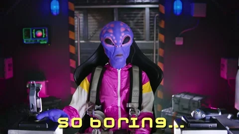
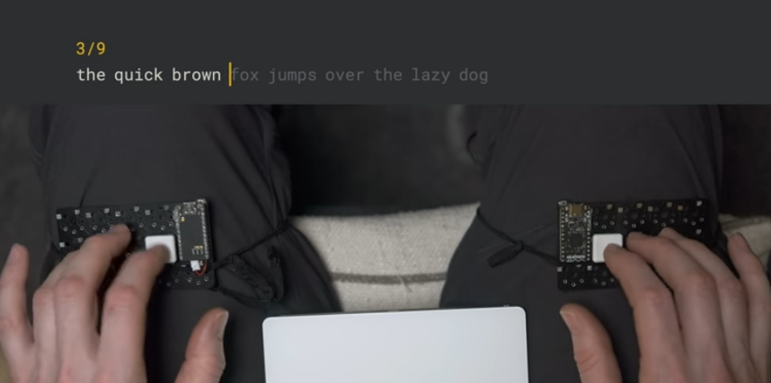
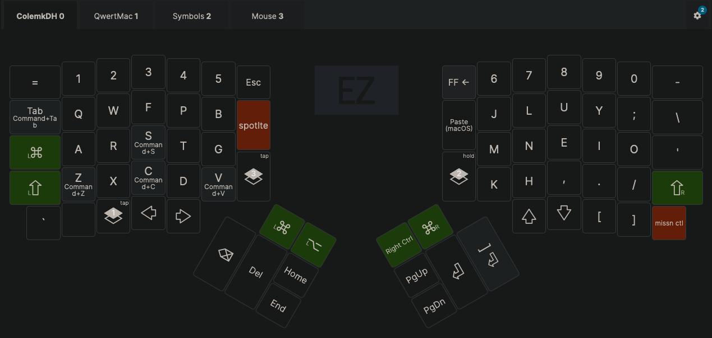
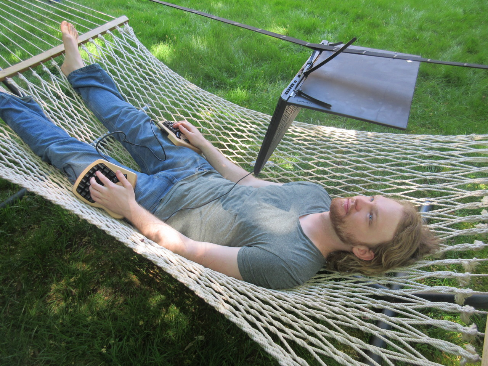
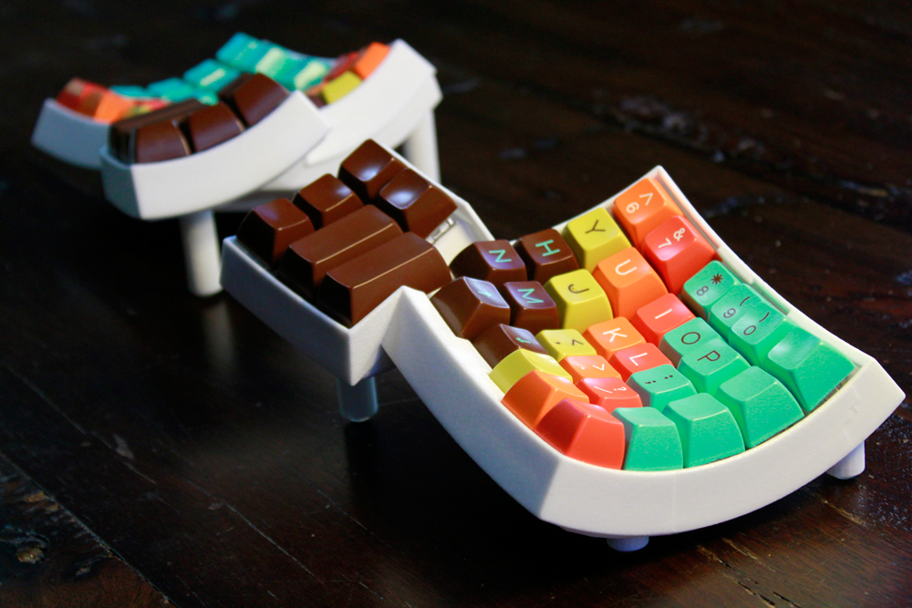
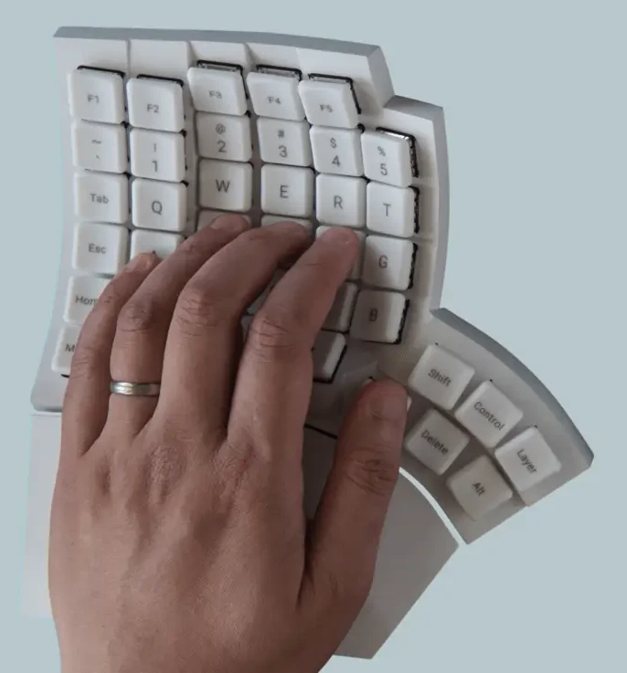

# <!-- fit --> Keyboards!

## by Jono

<small>(see text content in speaker notes)</small>

---

---

<!--
I promise you will learn something, and its mostly pictures anyway.
-->

---

# <!-- fit --> Outline

- Look
- Feel
- Speed
- Functionality
- Ergonomics

<!--
in order from fun -> practical
-->

---

# Look

---

---

<!--
Gaming
-->

---

<!-- _class: lead -->

---

<!--
steam punk
-->

---

---

<!--
Colorful builds
-->

---

---

---

---

---

---

# Key caps

---

<!--
https://www.tinymakesthings.com/how-to-make-artisan-keycaps
-->

---

---

---

# Home Builds

---

---

---

---

<!--
3D Printed
-->

---

# <!-- fit --> FEEL

---

## Keyboard types

---

### Membrane

- simple construction
- low profile
- low price

<!--
like on your laptop
-->

---

### Optical

- fast
- precise

<!--
used by gamers
-->

---

### <!-- fit --> Mechanical

- durable
- repairable
- customizable (sound and feel)

---

### Machanical Switch Types

---

<!--
There are 3 basic categories.
-->

---

<!--
Now there a hundreds of variations
-->

---

<!-- _class: lead -->

<!--
Gateron optical switch profile example
-->

---

---

### Sound categories

- volume
- depth
- ping
- pop
- pitch
- rattle
- grind
- click
- clack
- thock <--

---

### Sound tweaking

- plate composites
- foam bases
- silicon mat dampener
- wood and paper base
- O-rings (mute rings)
- grease/lube
- tape modification
- stabilizers
- dampeners
- spring weights

---

[Switch sounds demo](https://www.youtube.com/embed/e4ODi1hbUd4)

<iframe width="100%" height="100%" src="https://www.youtube.com/embed/e4ODi1hbUd4?si=-dVsTCyJLVbvw3Gl" title="YouTube video player" frameborder="0" allow="accelerometer; autoplay; clipboard-write; encrypted-media; gyroscope; picture-in-picture; web-share" referrerpolicy="strict-origin-when-cross-origin" allowfullscreen></iframe>

---

[Keyboard ASMR](https://www.youtube.com/watch?v=U7Y50T7NKyw)

<iframe width="100%" height="100%" src="https://www.youtube.com/embed/U7Y50T7NKyw?si=SU8qTELzzgMnfMsl" title="YouTube video player" frameborder="0" allow="accelerometer; autoplay; clipboard-write; encrypted-media; gyroscope; picture-in-picture; web-share" referrerpolicy="strict-origin-when-cross-origin" allowfullscreen></iframe>

---

# Speed

---

# <!-- fit --> Stenography

---

---

<!--
$50 asterex, 2024 kickstarter

https://www.kickstarter.com/projects/stenokeyboards/the-asterisk-steno-keyboard-for-beginners?ref=4vgl2c
-->

---

<video 
src="https://cdn.shopify.com/videos/c/o/v/3a5752f4c90548008e412a1febab728d.mp4" controls></video>

<!--
Uni v4 stenograph
This is what modern chording looks like
-->

---

# 3D Chording

---

<!--
This is the Charachorder One
with 3-D Tactile Switches
-->

---

---

---

<!--
https://www.tiktok.com/@rileyfordkeen/video/7176769863149587758

<video src="./media/charachorder500wpm.mp4" controls height="50%"></video>

Note:
Mention leaderboard controversy

-->

---

# Functionality

---

# Functionality

## Portable

---

<!-- _class: lead -->

<!--
Rollup keyboard
-->

---

<!--
Laser Projection Keyboard
-->

---

# Functionality

## Wearable

---

<!--
Tap strap 2

Single hand typing
Multiple mouse modes
Haptic feed back
-->

---

<!--
"Beauty and the Geek" jeans is a wearable concept. It even has speakers behind the knees.
-->

---

## Form Factor

---

<!--
ranges from 104 keys to 47
-->

---

<!--  -->

<!--
40% keyboard, 47 keys
-->

---

# Key Minimization

---

<!--
Chordie 16 keys
-->

---

<!--

2 Keys

Ben Vallack created a single key PCB and created a tap-dance based layout that allows for 50 different characters.
-->

---

<!--
0 keys - morse code
https://github.com/veggiedefender/open-and-shut
-->

---

# <!-- fit --> Key Maximization

---

<!--
Honeywell 142 keys
-->

---

# Layering

---

<!--
These are screenshots of the config for my Ergodox EZ
 -->

---

---

---

---

<!-- _class: lead -->

<!--
Optimus Popularis Keyboard
Programmable LED screen keys
Kind of like the Mac magic bar
-->

---

<!-- _class: lead -->

# <!-- fit --> Ergonomics

<!--
* For now we are stuck with using keyboards.
* Typing at a desk for hours a day can only be so ergonomic.
* How we we minimize repetitive stress injuries?
-->

---

---

<!-- _class: lead -->

---

---

---

---

Ok, back to the keebs...

---

## Ergonomic Forms

---

<!--
This is the Kinesis advantage.

The only keyboard that I have ever used that is a joy to type on.

They inspired the invention of Cherry Browns.
-->

---

## <!-- fit --> Split

---

---

## <!-- fit --> Concave

---

---

## <!-- fit --> Tenting

---

---

<!--
https://hackaday.com/2021/08/04/inputs-of-interest-safetype-vertical-keyboard-with-mirrors-puts-pain-in-the-rear-view/
-->

---

## Thumb clusters

<!--
Moonlander
-->

---

<!--
Dygma - maximized thumb clusters
16 keys!
-->

---

# <!-- fit --> Columnar

---

<!--
Staggering was necessary for typewriters.

Notice how left and right stagger are not equal. This makes travel inconsistent.
-->

---

# Ergonomic Layouts

---

## But first, some history...

<!--
How did we get here?

---

- In the 1860's C. L. Sholes made the first commercial typewriter in a Milwaukee, using U.S. English.

- Early prototypes used alphabetically ordered keys. But they were difficult to type with (since our fingers don't read left to right).

- **Fun fact**: Some had only capitol letters and numbers 2-9.
  It was suggested to use letters o and l for 0 and 1.

- After 5-10 years of iterations, QWERTY was born.

---

- QWERTY was designed to keep common letter pairs apart to prevent jamming.

- Contrary to mythology, it was not specifically designed to slow typers down.

- Bigram spread was actually a good way to allow for fast typing since it alternates the work between hands. But we can do better now with more data driven approaches.

- QWERTY has remained the de facto standard ever since the first typewriter. Most variations make minimal changes to it, even when not using English.

-->

---

<!--

### French (AZERTY)

Other Latin character languages build off qwerty. Sometimes with small variations.
-->

---

<!--

### Greek

Even in languages with different characters they build off qwerty.
-->

---

# Alternative layouts

---

<!--
This is the first well know alternative layout. Created 1936.

August Dvorak studied letter frequencies and the physiology of the hand.

Common letters should be in the home row.

Notice vowels on the left hand and special characters rearranged.

-->

---

## <!-- fit --> Minimizing travel

<!--
Mention words/languages vs programming
-->

---

<!--
Many QWERTY keys are preserved as well as control commands.
-->

---

<!--
Even with tarmak, it typically takes months to become fully proficient.
-->

---

[Touch typing handshape comparison](https://www.youtube.com/watch?v=eNeYmr48JUM)

<iframe width="100%" height="100%" src="https://www.youtube.com/embed/eNeYmr48JUM?si=0gQho2SfR7FodLL7" title="YouTube video player" frameborder="0" allow="accelerometer; autoplay; clipboard-write; encrypted-media; gyroscope; picture-in-picture; web-share" referrerpolicy="strict-origin-when-cross-origin" allowfullscreen></iframe>

<!-- 
---

## Personalized layouts

---

notes:
switching individual keys
swap caps lock for control or delete -->

---

## Ergonomics

### Takeaways

* High effort (months), high return: Alternate layouts

* Low effort (1 week), medium return: Thumb clusters!

---

## Ergonomics

### FAQ

<!--
These are questions I regularly get when people see my keyboard.
-->

---

### I already type 100 WPM. Do these optimizations really make you faster?

 

* ## __Its all about comfort__

<!--
Its all about comfort
Speed could also happen...
-->

---

### Can you still type on other peoples keyboards?

 

* ## __Yes__

<!--
Sure.
I use QWERTY on my laptop and phone every day
-->

---

### What's the best layout?

 

* ## __It depends__

<!--
It depends on what you are doing. english? spanish? programming?
-->

---

### I don't have time to learn another layout. Is there something quick and easy that I can do instead?

 

* ## __Thumb clusters!__

<!--
Thumb clusters! Biggest bang for your buck.
Your pinkies will thank you.
-->

---

### Seems like a waste of money

* ### __You press thousands of keys a day__

<!--
More people spend more and more time at a computer every day.

The average office worker presses 2-10k keys per day. Thats millions a year.

You probably spend 5+ hours a day at a keyboard. Why use a piece of junk?

Unless you have a deprivation mind set. Then go for it.
-->

---

# Mobile specific

---

---

---

<!-- _class: lead -->

# Community

---

<!--
NorCal 2023 Mechanical Keyboard Meetup

Meetups and conventions tend to be focused on mechanical feel/style - not ergonomics.

https://arun.is/blog/norcal-2023-mechanical-keyboard-meetup/

https://kbd.news/meetups
-->

---

<!-- [Meetups](https://kbd.news/meetups)

--- -->

<!--

Found this list made in 2022

https://www.reddit.com/r/MechanicalKeyboards/wiki/keyboard_subreddits/
-->

### Mechanical Keyboards

/r/mechmarket
/r/switchmodders
/r/keycaps
/r/keycapdesigners
/r/MechanicalKeyboards
/r/vintagekeyboards

### Layouts and Tech

/r/Dvorak
/r/colemak
/r/KeyboardLayouts
/r/keyboardshortcuts

### DIY

/r/PeripheralDesign
/r/CustomBoards

### Ergo

/r/olkb
/r/ergodox
/r/ErgoMechKeyboards
/r/ergonomics

### Image Galleries

/r/ArtisanMacro
/r/CatsOnKeyboards ->
/r/CustomKeyboards
/r/cyberDeck
/r/mechanicalheadpens

### Adjacent Subreddits

/r/hardwareswap
/r/keyboard
/r/keyboards
/r/MouseReview
/r/TrackBalls
/r/typewriters
/r/BucklingSprings
/r/Topre

---

# Key takeaways

* Thumb clusters are awesome.

* QWERTY is an outdated convention.

* Keyboard customization is a (fun) rabbit hole.

<!--
If there are any things I hope you got out of this, it would be these.
-->

---

# Join me next time for ...

---

# The mouse!

